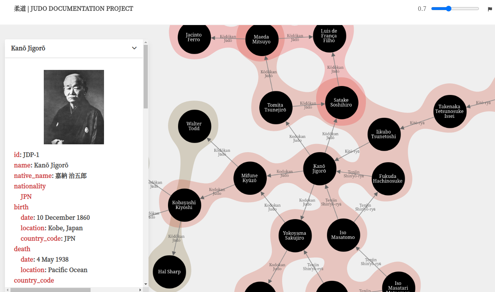

# Martial Arts Lineage Tree

### Judo Documentation Project

The Martial Arts Lineage Tree is a community-driven database of
teacher/student interactions, presented as an interactive lineage
tree.

There are three main components to this:

* A database of persons, training places, styles, organisations, and
  sources, using YAML as the format to make manual editing in a
  structured form as painless as possible.
* A parser that converts the database into a [Cytoscape.js JSON
  format](https://manual.cytoscape.org/en/stable/Supported_Network_File_Formats.html#cytoscape-js-json), supported in both [Cytoscape](https://cytoscape.org) and [Cytoscape.js](https://js.cytoscape.org/)
* [A web page that presents the data as an interactive tree](https://judo-documentation-project.github.io/judotree/), allowing
  exploration of the (sometimes complex) lineage tree.

## How it works

Creating, adding to, and correcting the YAML files is what drives everything else.

Each YAML file describes an individual that has at least one "teacher" (see FAQ
for terms): the relationships are always from student -> teacher, and not the
other way around. This means that the YAML files identify teachers, but not
explicitly students, those being visualised in the tree by their own
relationship as students.

The YAML format covers these main areas:

* Personal data: name, place and data of birth, photo, etc.
* Teachers: who taught the individual what, where, and when.
* Rank: what rank was attained by the individual, when, and by whom.
* Sources: list of sources used.

## How to do it

The entire process has been built (purposely) around git, and specifically
GitHub (more on that in the FAQ below). To participate, you'll need:

- A GitHub account.
- Some basic knowledge on how to edit and commit files in GitHub.

The GitHub account is the easy part. If you already know git and are used to
git-based workflows, there's no secret here: feel free to clone it or fork it,
create a branch and edit files with any editor, and submitt the PR.

If the previous paragraph was cryptic, using GitHub's interace will mostly guide
you through until we improve instructions:

1. Find an existing file, or identify a missing one about someone that you want
   to add.
2. [Create a new file](https://docs.github.com/en/repositories/working-with-files/managing-files/creating-new-files) based on an existing entry, or on a template, or click
   "Edit" in an existing file
3. This will create a fork of the repository in your account; edit the file and
   follow the instructions to commit to your copy, and submit a Push Request.
4. In the Push Request discussion, address any comments/requests.

The above can still be challenging for someone completely new to GitHub, but we
will improve the instructions in due time.

We will start by focusing on "leafs" that can link to some of the
existing "nodes"; this means that we will focus on finding branches that can
connect to any of the existing individuals, instead of adding unconnected persons.

At a later stage we will relax this requirement, but for now any addition should
be connected _at least in one path_: it's perfectly fine to add more "ancestors"
that end up being unconnected, if they are connected to someone that is linked
with existing individuals.

### The importance of sources

Every entry should have one or more sources that allows anyone to determine from
where the information is derived. This might seem overkill when thinking on
well-known aspects of well-known people, but it's very important to be
consistent about it: the reality is that our knowledge is often based on a mix
of myths, half-truths, unconfirmed events, and partial understanding of real
events. By explicitly adding sources, we can at least clearly identify the
origin of the information.

Not all sources have the same status: a random comment in an internet forum, by
an anonymous user that doesn't state the origin of the information, is clearly
less authoritative than a published paper that underwent peer review. This is
not to say that one is right and the other is wrong: merely that, faced with
conflicting sources, those that identify their one sources carry more weight.

### Sources and lineages

How should we reflect conflicting information about lineage-related aspects?
Should we show only paths that can be shown to have sufficient backing? How to
determine what type of sources are acceptable?

The approach we took was to:

* Identify and add every "transmission" event that has some backing source with a minimum of relevance.
* Clearly indicate the quality of the source (in terms of how far does it go to
  support the assertion), so that anyone can immediately have an idea on the
  relative "weight" of each.

This is done through the use of a `quality` field in the `teachers` section.
This is inspired by the [GEDCOM standard used in
genealogy](https://gedcom.io/specifications/FamilySearchGEDCOMv7.html#g7enumset-quay),
and used precisely for the same reason.

* Absent: no review done on the link, needs to be updated.
* 0: Estimated or based on unreliable evidence (e.g. unsourced comments, sources
  that have conflicting evidence that has shown to be false).
* 1: Information from indirect sources, like interviews or biographies, with
  potential for bias, and without any other direct evidence mentioned.
* 2: Secondary evidence, data recorded after the event but that directly
  supports the assertiob.
* 3: Direct and primary evidence, or by dominance of evidence.

There is always a degree of relativity in determining the "quality" of sources,
but these guidelines should be good enough to start with.

### Settling disputes

The more people participate in the project, the better, but also the more likely
it is that different perspectives on what should be added to the database exist.

The general approach will be to have (public) discussions on the relevant topic,
in the form of an Issue. The overall quality of the database is an important
goal, so the project lead will, if needed, determine the final outcome if there
is no possibility of consensus.

Having an extensive database is good, but it is not as important as having a

## FAQ

### General

### Technology

#### Why Git/GitHub

Using git, and GitHub, is one of the core concepts in this project because it
addresses several requirements that would otherwise require specific solutions:

* It provides authorship information for every change.
* It allows public scrutiny of the data and the editing process.
* It provides tools to add, revert, and discuss changes.
* It's easily automated.
* It's resilient to catastrophic changes.

While there is a learning curve to using it, the advantages overwhelmingly
compensate them. The last point, specifically, means that data here will be
always availabile, and can at any time be forked ("copied") by anyone. Those
that remember the amount of information lost with the demise of `judoforum.com`
will understand why this is not irrelevant.

#### Why YAML

I wanted something that would be easy to edit be humans, without special tools,
while providing enough structure to be easily parsed. YAML is one of the most
obvious choices for this.

#### Why Javascript/Bulma/Cytoscape.js/...

Most technological choices were made because they were the most

* Cytoscape.js: this is a popular and very complete graph theory toolkit (likely
  the most used) in Javascript. Since having a client application (a web page)
  was one of the core goals, Cytoscape.js was an obvious choice that was
  confirmed after some initial tests.
* Node.js: the initial YAML parser was written in ~50 lines of Common Lisp.
  Since the heavy lifting is being done at the client app (in Javascript), using
  node.js was a logical choice to keep everything aligned. This is itself is
  relatively unimportant, but node.js is also very well supported in terms of
  Continuous Deployment, used to build the web page, and has a rich library ecosystem.
* Bulma.io: I wanted something that would work for both desktop and mobile, had
  good defaults, and allowed customisation. There are many options for this,
  Bulma was the one that worked for me with minimal testing.
* Parcel.js: worked as expected with minimal configuration.

### YAML format

#### Martial arts, styles, sports: what terminology is used

The YAML format is a work-in-progress and not written in stone, but some of the
terms were a compromise between those that would be more correct to a specific
situation, and those that had a wider scope. An example of this is `style`,
which will be applied to anything from Kodokan Judo to Catch-as-Catch-Can . As
we progress, improvements in terminology can be made.

#### Is everything mandatory? Is everything optional?

A YAML schema will be available Real Soon Now, but the only mandatory fields are:

* ID
* Name
* Teacher (1 instance)
* Sources (at least 1)

Not mandatory but almost are nationality/place of birth/native name, in the
sense that they are usually easy to add and can be used for visualisation
purposes. The more information, the better.

#### What are the IDs? Should I add them?

This is a work-in-progress that will change in the short-term, but for now the
IDs are just incrementally generated "by hand". When adding something new, use
existing IDs (of existing persons/styles) when possible, and leave them blank
for the new individual, the ID will be added after.

#### Why is rank separate from teachers?

Different martial arts have different approaches: some have a teacher-student
relation that includes rank, while others have central organisations that bestow
rank. As such, learning from someone is not always the same as receiving rank
from someone, even if it's the teaching that contributes to the body of
knowledge. Separating rank from teachers allows to keep track of the
teacher-student relationship without making assumptions about rank.

#### Shouldn't sources be atachable to a specific section (teachers, rank), instead of being applied to everything?

Yes, this is likely a better idea. Currently, sources are at the "root" level to keep things simple: it's already several orders of magnitude better to have sources listed, and enforce that practice.

Following the genealogy research parallel, it would be better to have sources that can be attached to a specific assertion:

> A given source may be the basis for many different assertions. Thus, much of the information is the same for many different citations of that source, such as the publisher information; and yet, some of the information varies from one citation to the next, such as the page number for a specific item. Consequently, the SOURCE_STRUCTURE includes a sophisticated mechanism for sharing general source description information that is common across multiple citations, while at the same time allowing more specific information to be more directly associated with individual citations. All tags within the SOURCE_STRUCTURE participate in this approach.

We need to balance how to do this with keeping it simple enough - as simple as it can be, but not simpler. One way to do it would be:

1. Add `source` fields in the specific section (e.g. `teachers->[id=<ID of Teacher 1>->source`).
2. Use the `uri` as the source ID, which would then point to a more complete entry for the source, in a separate YAML, with name, etc.
3. Add a `source->page`or `source->citation` field.

We will implement the first shortly enough; the second is an open discussion, and the third will depend on how much this becomes a real issue.
